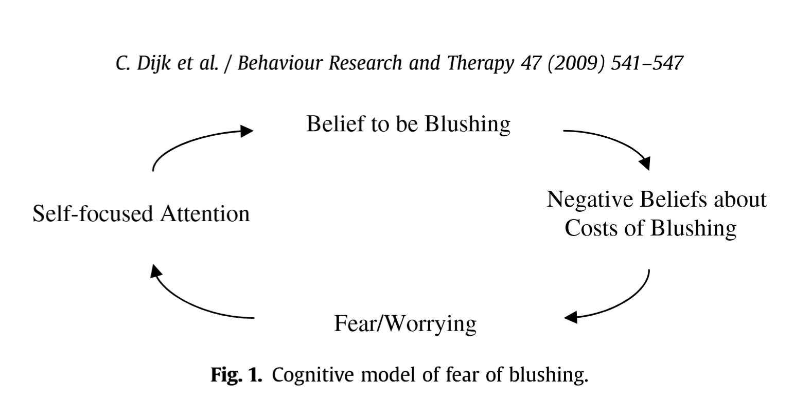
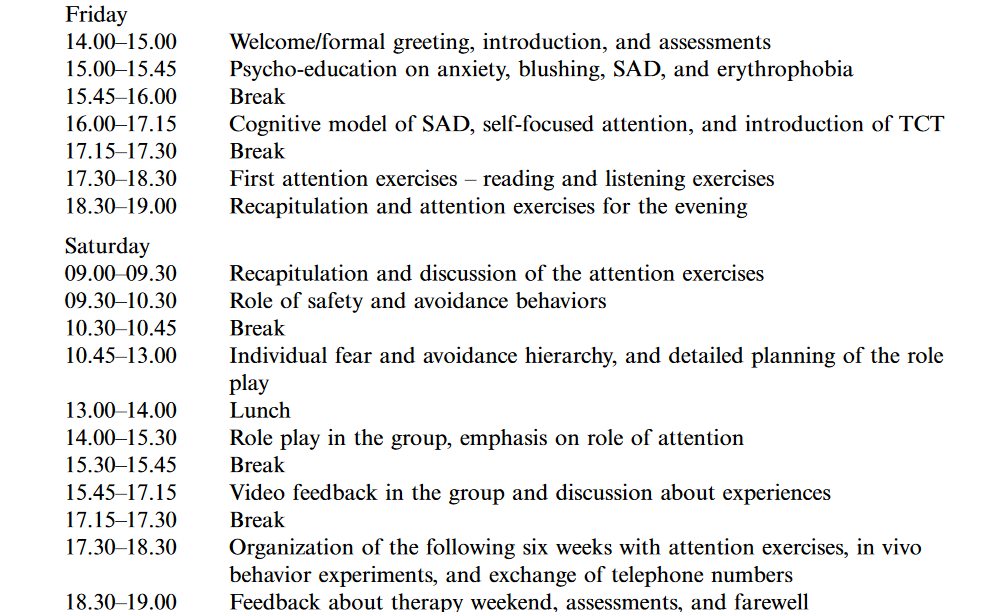

## Czym jest erytrofobia?

Chorobliwy lęk przed czerwienieniem się. Jest zwykle jednym z objawów fobii społecznej, choć może też występować samodzielnie (_erythrophobia separata_). Zwykle skutkuje rumienieniem się, np. w sytuacjach towarzyskich, co może prowadzić do unikania ich.

## Cognitive model of fear of blushing 

## Erytrofobia i jej związki z osobowością 

* Wyniki pokazały, że wśród dorosłych lęk  przed zaczerwienieniem był najlepiej przewidziany przez zmienną *sumienności* (korelacja pozytywna), podczas gdy wśród dzieci lęk przed rumienieniem się był najlepiej przewidywany przez *neurotyczność* (korelacja pozytywna). 
* Porównując dwie próbki, osoby w wieku dojrzewania wykazywały większy lęk przed rumienieniem się niż dorośli, a także kobiety zgłaszały więcej obaw przed rumieniem się niż mężczyźni.

## Terapia erytrofobii

## TASK CONCENTRATION TRAINING vs. COGNITIVE THERAPY

## Can a one-weekend group therapy reduce fear of blushing?

## Dwudniowe warsztaty psychoedukacyjne (W POLSCE)

## DZIEŃ I

ROZMOWA Z PACJENTEM NA TEMAT:

1. różnice między erytrofobia a napadowym czerwienieniem się twarzy oraz co to właściwie jest za choroba;
2. różne dostępne metody leczenia;
3. procedurę kwalifikacji do leczenia chirurgicznego;
4. ogólny przebieg samego zabiegu;
5. ewentualne powikłania i skutki uboczne leczenia, z dużym naciskiem na nadpotliwosc kompensacyjną

## DZIEŃ II

Skupienie się psychologicznych aspektach choroby. Pokazanie pacjentom techniki terapeutycznej, która nazywa się RTZ- Racjonalna Samoanaliza (zrozumienie swoich mechanizmów psychologicznych odpowiedzialnych za czerwienienie się). Zakończenie warsztatów treningiem relaksacyjnym. 

## Late results of endoscopic thoracic sympathectomy for hyperhidrosis and facial blushing

## Czy ibuprofen jest skuteczny? 

## The need of dermatologists, psychiatrists and psychologists joint care in psychodermatology

## Bibliografia

* Azambuja, R. D. (2017). The need of dermatologists, psychiatrists and psychologists joint care in psychodermatology *, 92(1), 63–71.
* Chaker, S., Hofmann, S. G., & Hoyer, J. (n.d.). Anxiety , Stress & Coping : An Can a one-weekend group therapy reduce fear of blushing ? Results of an open trial, (January 2014), 37–41. https://doi.org/10.1080/10615800903075132
* Dijk, C., Jong, P. J. De, & Müller, E. (2010). Blushing-Fearful Individuals ’ Judgmental Biases and Conditional Cognitions : An Internet Inquiry, 264–270. https://doi.org/10.1007/s10862-009-9134-4

##

* Dijk, C., Voncken, M. J., & Jong, P. J. De. (2009). Behaviour Research and Therapy I blush , therefore I will be judged negatively : influence of false blush feedback on anticipated others ’ judgments and facial coloration in high and low blushing-fearfuls. Behaviour Research and Therapy, 47(7), 541–547. https://doi.org/10.1016/j.brat.2009.03.005
* Dijkstra, P., Barelds, D. P. H., & Buwalda, F. (2014). Fear of blushing : Relations with personality among children and adults. Personality and Individual Differences, 66, 5–9. https://doi.org/10.1016/j.paid.2014.02.034

## 

* Mulkens, S., Jong, P. J. De, & Bo, S. M. (1997). Practitioner Task Concentration Report Training and Fear of Blushing, 4(4).
* Rijsemus, W., & Jong, P. J. De. (2002). Self-Focused Attention and Social Anxiety : The Effects of Experimentally Heightened Self-Awareness on Fear , Blushing , Cognitions , and Social Skills, 26(4), 461–472.
* Smidfelt, K., & Drott, C. (2011). Late results of endoscopic thoracic sympathectomy for hyperhidrosis and facial blushing. British Journal of Surgery, 98(12), 1719–1724. https://doi.org/10.1002/bjs.7682