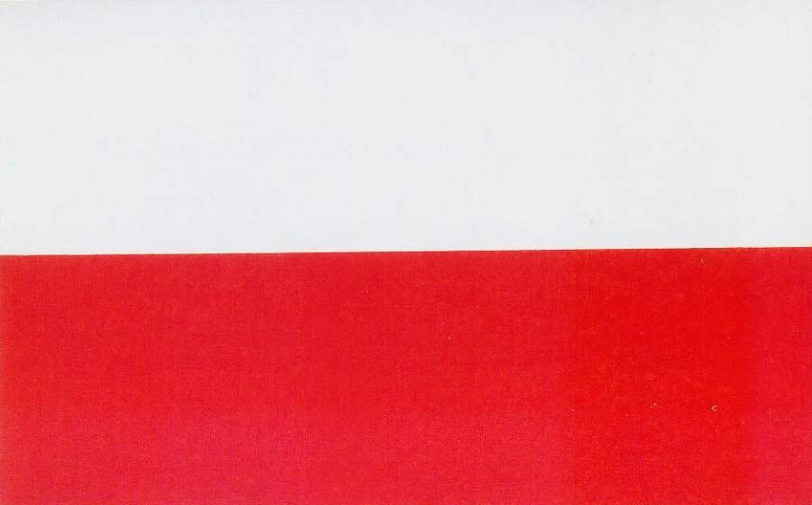
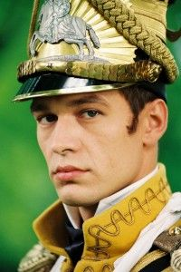

# Co to jest **kultura honoru**?

## Czy **honor** może być nazwany wartością uniwersalną kulturową?

## 

## 

## 

## 

## 

# Warunki ekologiczne kultury honoru i jej psychologiczne konsekwencje

## Duma, wstyd, gniew

 

## Badania Nisbetta

* Badania archiwalne
* Badania eksperymentalne

##

## Względne zmiany stężenia hormonów stresu w warunkach eksperymentalnych i kontrolnych w zależności od regionu pochodzenia 

## 

## Konsekwencje zniewagi dla zachowania interpersonalnego oraz reputacji społecznej w zależności do regionu pochodzenia

#

## Inne pejpery

* School Violence and the Culture of Honor (Ryan P. Brown, Lindsey L. Osterman, and Collin D. Barnes The University of Oklahoma)

* Understanding  College Sport Fans'Experiences of and Attempts to Cope with Shame (Julie A. Partridge Southern Illinois University Carbondale, Daniel L. annMurray State University Jeff Elison Purdue University)

* A different kind of honor culture: Family honor and aggression in Turks (Yvette van Osch, Seger M. Breugelmans,Marcel Zeelenberg and Pinar Bölük)

* Sport jako społeczna enklawa kultury honoru (Szmajke A., Machera K.)

#

## A co z Polską?

 
 
## Honor po polsku

* Słowo honoru
* Bóg, Honor, Ojczyzna
* Ślubowane immatrykulacyjne

## Honor w literaturze 

# Dziękujemy za uwagę 

## Bibliografia

* Kultura honoru w procesie socjalizacji zawodowej wojskowych, Jarmoszko Stanisław, 
Colloquium Wydziału Nauk Humanistycznych i Społecznych AMW 2014 
* Kulturowe ramy zachowań społecznych, Paweł Boski, Wydawnictwo Naukowe PWN, Warszawa 2009

